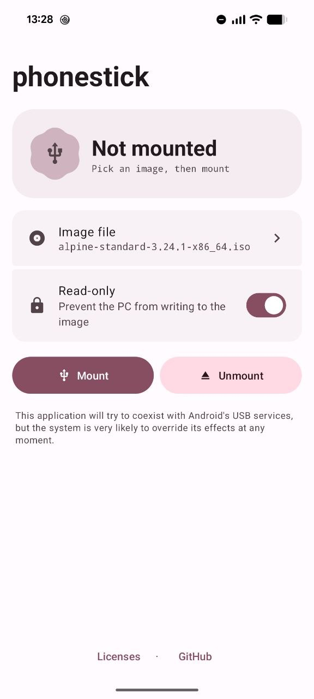

# phonestick

Turn a **rooted** Android phone into a USB thumbdrive. Pick a disk image, tap Mount, plug the phone into a PC — it shows up as a regular USB mass-storage device, ready to boot a distro ISO.



## How it works

The app drives the Linux **configfs USB gadget** over a root shell: it creates a `mass_storage` gadget backed by your image file, detaches Android's stock USB gadget from the controller, and binds its own in place. Unmount reverses it. No native code — just a shell script issued from Kotlin.

## Requirements

- Root access (`su`)
- Android 8.0+ with a configfs USB gadget kernel (any Treble-era device; the app tells you if the kernel lacks it)
- Patience with Android: the system may re-assert control of the USB port at any moment — the app coexists with Android's USB services on a best-effort basis

## Guide

1. **Add an image** — tap the *Image file* row, then the **+** button, and pick an ISO/IMG. It's copied into the app's own image library (so it can't be moved or deleted while mounted).
2. **Pick it** — tap the image in the library list.
3. **Read-only** — leave it on to keep the PC from writing to the image; turn it off if you want a writable drive.
4. **Mount**, then connect the phone to the PC over USB. The status card shows what's currently being served.
5. **Unmount** when you're done to hand the USB port back to Android.

Theming follows Material You: on Android 12+ the whole app (light and dark) re-colors from your wallpaper.

## Building

```bash
./gradlew assembleDebug    # debug APK
./gradlew installDebug     # build + install on a connected device
```

Standard Gradle project (AGP 7.3.1, Kotlin). Release builds are signed with the debug keystore by default — swap in a real keystore for distribution.

## Credits

phonestick is a fork of a fork of a fork, and stands on all of it:

- [streetwalrus/android_usb_msd](https://github.com/Streetwalrus/android_usb_msd) — the original **USB Mountr** this app descends from (MIT), reached via [donfanning/android_usb_msd](https://github.com/donfanning/android_usb_msd)
- [Swyter/android-usb-mass-storage-enable](https://github.com/Swyter/android-usb-mass-storage-enable) — the configfs gadget script at the heart of mounting, brought in through [Swyter/phonestick](https://github.com/Swyter/phonestick)
- [dratini0/phonestick](https://github.com/dratini0/phonestick) and [JinbaIttai/phonestick](https://github.com/JinbaIttai/phonestick) — links in the fork chain
- [Unusual-2000/phonestick](https://github.com/Unusual-2000/phonestick) — the upstream this fork tracks
- Earlier versions also carried file-picker fixes from [kodiak-it/USB_Mountr](https://github.com/kodiak-it/USB_Mountr) and path-resolution code from [aFileChooser](https://github.com/iPaulPro/aFileChooser)

Libraries:

- [libsuperuser](https://github.com/Chainfire/libsuperuser) by Chainfire (Apache 2.0) — the root shell
- [Material Components for Android](https://github.com/material-components/material-components-android) (Apache 2.0) — the Material 3 UI
- [Kotlin](https://github.com/jetbrains/kotlin) (Apache 2.0)

## See also

- @morfikov's [tutorial](https://gist.github.com/morfikov/0bd574817143d0239c5a0e1259613b7d) on setting up your phone as a boot device for a LUKS setup
- [DriveDroid fix Magisk module](https://github.com/overzero-git/DriveDroid-fix-Magisk-module) if you're after DriveDroid on recent hardware

## License

[MIT](LICENSE)
